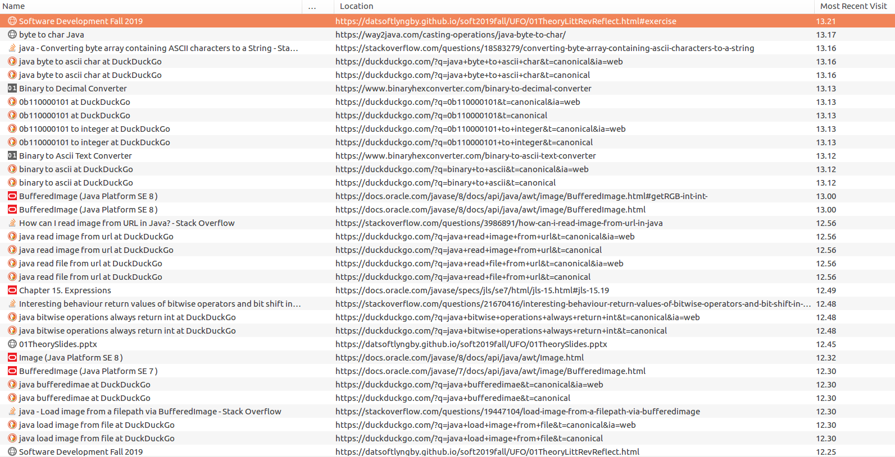

## Assignment 1

### Convenience links

[Assignment description](https://datsoftlyngby.github.io/soft2019fall/UFO/01TheoryLittRevReflect.html#exercise)
[App.java](src/main/java/cphb/ufo/App.java)


### Reflection

I only had three problems(luck me) so here's my reflections.

1. **Boring**. The first issue is not really an issue, it just happens that it took a while to figure out, a problem that is hard to estimate. Although it ended being pretty simple(see `assembleBits` method in [App.java](src/main/java/cphb/ufo/App.java)) and therefore took less than I thought
2. I was looking a the most-significant bit... The [BufferedImage#getRGB](https://docs.oracle.com/javase/8/docs/api/java/awt/image/BufferedImage.html#getRGB-int-int-) Javadoc states that the pixel value format is "**the default RGB color model (TYPE_INT_ARGB)**". If it was RGB it was fine, but if it's ARGB then I need to shift the pixel value to get the value for red. Wasted a lot of time on that. Finally came back to the assignment description and realized that the value is actually hidden in the least significant bit, and since it _should_(it is) be RGB it pretty much means that it is the very first bit of the pixel. I pretty much overcomplicated things for myself :)
3. The output I was getting was **Cnofs`utm`uinor, tiir!ir tid!sebsdt!messagd!nf tid!TGN!bmass  (on, ont 43(**. Which for the most part is printable, so I thought that it may just be correct(it wasn't). Luckily I decided to print out the bit groups I was converting to a character. Because of the way I initially wrote my loop, for the first iteration I was constructing letters from 9 bits where one of them would be lost and screw up the remaining ones. The underlying problem was my algorithm was shitty.

Overall I suppose the most time-consuming and stupid problem was #2. Funny enough the most helpful resource was the assignment description itself.. should read that more carefuly.

### Browser history

For actual URLS, [see below](#browser-history-links)


### Diary:

```
12:30 start
12:45 
    What: assmebing the bits into a string
    Problem: making an algorithm to do that^
    Done in: 15mins
12:55 first program run
13:00
    what: debugging
    Problem: all bits retrieved from image are considered 1
    Done in: 10mins
13:15
    what: debugging output
    Problem: the message seems inorrect(although it might just be Casper messing with us).
    Done in: 15mins
13:20 done
```


### Browser history links
```
https://way2java.com/casting-operations/java-byte-to-char/
https://stackoverflow.com/questions/18583279/converting-byte-array-containing-ascii-characters-to-a-string
https://duckduckgo.com/?q=java+byte+to+ascii+char&t=canonical&ia=web
https://duckduckgo.com/?q=java+byte+to+ascii+char&t=canonical
https://www.binaryhexconverter.com/binary-to-decimal-converter
https://duckduckgo.com/?q=0b110000101&t=canonical&ia=web
https://duckduckgo.com/?q=0b110000101&t=canonical
https://duckduckgo.com/?q=0b110000101+to+integer&t=canonical&ia=web
https://duckduckgo.com/?q=0b110000101+to+integer&t=canonical
https://www.binaryhexconverter.com/binary-to-ascii-text-converter
https://duckduckgo.com/?q=binary+to+ascii&t=canonical&ia=web
https://duckduckgo.com/?q=binary+to+ascii&t=canonical
https://docs.oracle.com/javase/8/docs/api/java/awt/image/BufferedImage.html#getRGB-int-int-
https://docs.oracle.com/javase/8/docs/api/java/awt/image/BufferedImage.html
https://stackoverflow.com/questions/3986891/how-can-i-read-image-from-url-in-java
https://duckduckgo.com/?q=java+read+image+from+url&t=canonical&ia=web
https://duckduckgo.com/?q=java+read+image+from+url&t=canonical
https://duckduckgo.com/?q=java+read+file+from+url&t=canonical&ia=web
https://duckduckgo.com/?q=java+read+file+from+url&t=canonical
https://docs.oracle.com/javase/specs/jls/se7/html/jls-15.html#jls-15.19
https://stackoverflow.com/questions/21670416/interesting-behaviour-return-values-of-bitwise-operators-and-bit-shift-in-java
https://duckduckgo.com/?q=java+bitwise+operations+always+return+int&t=canonical&ia=web
https://duckduckgo.com/?q=java+bitwise+operations+always+return+int&t=canonical
https://datsoftlyngby.github.io/soft2019fall/UFO/01TheorySlides.pptx
https://docs.oracle.com/javase/8/docs/api/java/awt/Image.html
https://docs.oracle.com/javase/7/docs/api/java/awt/image/BufferedImage.html
https://duckduckgo.com/?q=java+bufferedimae&t=canonical&ia=web
https://duckduckgo.com/?q=java+bufferedimae&t=canonical
https://stackoverflow.com/questions/19447104/load-image-from-a-filepath-via-bufferedimage
https://duckduckgo.com/?q=java+load+image+from+file&t=canonical&ia=web
https://duckduckgo.com/?q=java+load+image+from+file&t=canonical
https://datsoftlyngby.github.io/soft2019fall/UFO/01TheoryLittRevReflect.html
```